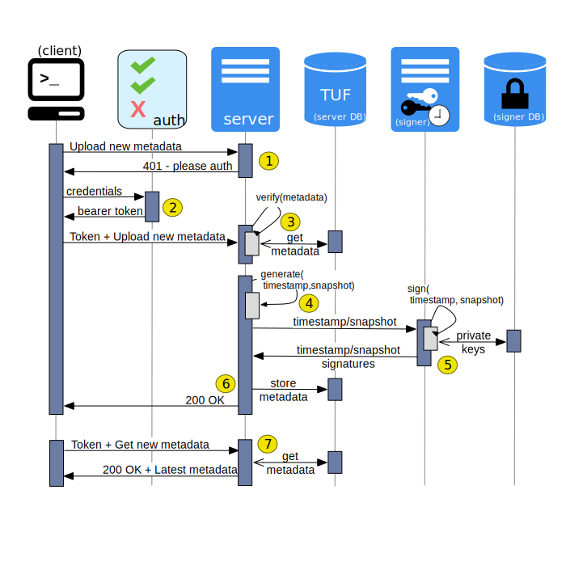

# Trivy


[https://github.com/aquasecurity/trivy](https://github.com/aquasecurity/trivy)

A Simple and Comprehensive Vulnerability Scanner for Containers, Suitable for CI.

## [Abstract](https://github.com/aquasecurity/trivy#abstract)

`Trivy` (`tri` pronounced like **tri**gger, `vy` pronounced like en**vy**) is a simple and comprehensive vulnerability scanner for containers. A software vulnerability is a glitch, flaw, or weakness present in the software or in an Operating System. `Trivy` detects vulnerabilities of OS packages (Alpine, RHEL, CentOS, etc.) and application dependencies (Bundler, Composer, npm, yarn etc.). `Trivy` is easy to use. Just install the binary and you're ready to scan. All you need to do for scanning is to specify an image name of the container.

It is considered to be used in CI. Before pushing to a container registry, you can scan your local container image easily.

## [Features](https://github.com/aquasecurity/trivy#features)

## [Installation](https://github.com/aquasecurity/trivy#installation)

## [Quick Start](https://github.com/aquasecurity/trivy#quick-start)

### [Docker](https://github.com/aquasecurity/trivy#docker)

```sh
docker run --rm -v /var/run/docker.sock:/var/run/docker.sock \
    -v $HOME/Library/Caches:/root/.cache/ aquasec/trivy python:3.4-alpine
```

### [Filter the vulnerabilities by severities](https://github.com/aquasecurity/trivy#filter-the-vulnerabilities-by-severities)

```sh
$ trivy --vuln-type os ruby:2.3.0
```

### [Filter the vulnerabilities by type](https://github.com/aquasecurity/trivy#filter-the-vulnerabilities-by-type)

```sh
$ trivy --vuln-type os ruby:2.3.0
```


## [Continuous Integration (CI)](https://github.com/aquasecurity/trivy#continuous-integration-ci)

## [Vulnerability Detection](https://github.com/aquasecurity/trivy#vulnerability-detection)

## [Comparison with other scanners](https://github.com/aquasecurity/trivy#comparison-with-other-scanners)


------

------

------


# [Docker Notary](https://docs.docker.com/notary/getting_started/)

[https://github.com/theupdateframework/notary](https://github.com/theupdateframework/notary)

Notary is a tool for publishing and managing trusted collections of content. Publishers can digitally sign collections and consumers can verify integrity and origin of content. This ability is built on a straightforward key management and signing interface to create signed collections and configure trusted publishers.

With Notary anyone can provide trust over arbitrary collections of data. Using [The Update Framework (TUF)](https://www.theupdateframework.com/) as the underlying security framework, Notary takes care of the operations necessary to create, manage, and distribute the metadata necessary to ensure the integrity and freshness of your content.

## [Architecture and components](https://docs.docker.com/notary/service_architecture/)


## [Example client-server-signer interaction](https://docs.docker.com/notary/service_architecture/)




------

------

------


# [OWASP Zed Attack Proxy](https://www.zaproxy.org/)

https://www.zaproxy.org/

https://sekurak.pl/wprowadzenie-do-narzedzia-zed-attack-proxy-zap/

https://owasp.org/www-project-zap/


Zed Attack Proxy (ZAP) is a free, open-source penetration testing tool being maintained under the umbrella of the Open Web Application Security Project (OWASP). ZAP is designed specifically for testing web applications and is both flexible and extensible.

At its core, ZAP is what is known as a “man-in-the-middle proxy.” It stands between the tester’s browser and the web application so that it can intercept and inspect messages sent between browser and web application, modify the contents if needed, and then forward those packets on to the destination. It can be used as a stand-alone application, and as a daemon process.


# Docker

## Seccomp security profiles for Docker

Secure computing mode (`seccomp`) is a Linux kernel feature. You can use it to restrict the actions available within the container. The `seccomp()` system call operates on the seccomp state of the calling process. You can use this feature to restrict your application’s access.


```sh
$ grep SECCOMP /boot/config-$(uname -r)
CONFIG_HAVE_ARCH_SECCOMP_FILTER=y
CONFIG_SECCOMP_FILTER=y
CONFIG_SECCOMP=y
```


```sh
$ docker container run -it --rm --security-opt seccomp=<profile>.json alpine sh ...
```


### seccomp profile default

`-seccomp-profile=/etc/docker/seccomp.json`


### Run without the default seccomp profile

```sh
docker run --rm -it --security-opt seccomp=unconfined alpine sh
```

## Links

https://github.com/docker/labs/tree/master/security/seccomp


# Other

http://support.typora.io/Draw-Diagrams-With-Markdown/

https://blog.objectivity.co.uk/what-is-the-best-devops-topology-for-my-company/
